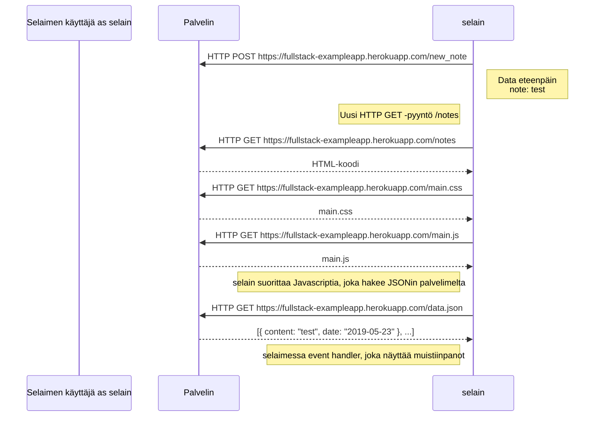

# 0.4 - Muistiinpanon lisääminen

```mermaid
sequenceDiagram
    participant Selaimen käyttäjä as selain
    participant Palvelin

    selain->>Palvelin: HTTP POST https://fullstack-exampleapp.herokuapp.com/new_note
    Note right of selain: Data eteenpäin <br/> note: test

    Note left of selain: Uusi HTTP GET -pyyntö /notes
    selain->>Palvelin: HTTP GET https://fullstack-exampleapp.herokuapp.com/notes
    Palvelin-->>selain: HTML-koodi

    selain->>Palvelin: HTTP GET https://fullstack-exampleapp.herokuapp.com/main.css
    Palvelin-->>selain: main.css

    selain->>Palvelin: HTTP GET https://fullstack-exampleapp.herokuapp.com/main.js
    Palvelin-->>selain: main.js

    Note left of selain: selain suorittaa Javascriptia, joka hakee JSONin palvelimelta

    selain->>Palvelin: HTTP GET https://fullstack-exampleapp.herokuapp.com/data.json
    Palvelin-->>selain: [{ content: "test", date: "2019-05-23" }, ...]

    Note left of selain: selaimessa event handler, joka näyttää muistiinpanot
```