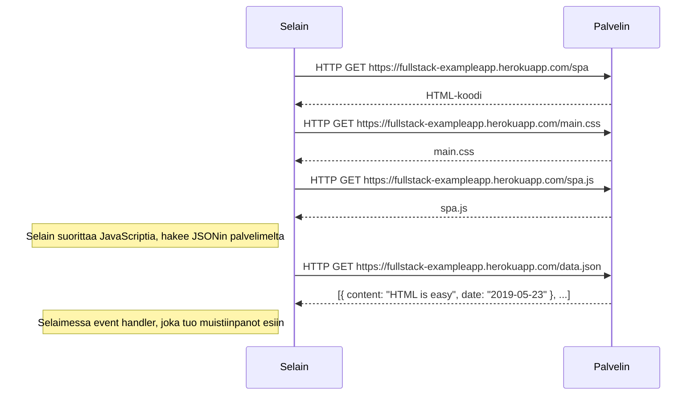

# 0.5 - Single page app - Muistiinpanojen lataus

```mermaid
sequenceDiagram
    participant Selain
    participant Palvelin

    Selain->>Palvelin: HTTP GET https://fullstack-exampleapp.herokuapp.com/spa
    Palvelin-->>Selain: HTML-koodi

    Selain->>Palvelin: HTTP GET https://fullstack-exampleapp.herokuapp.com/main.css
    Palvelin-->>Selain: main.css

    Selain->>Palvelin: HTTP GET https://fullstack-exampleapp.herokuapp.com/spa.js
    Palvelin-->>Selain: spa.js

    Note left of Selain: Selain suorittaa JavaScriptia, hakee JSONin palvelimelta

    Selain->>Palvelin: HTTP GET https://fullstack-exampleapp.herokuapp.com/data.json
    Palvelin-->>Selain: [{ content: "HTML is easy", date: "2019-05-23" }, ...]

    Note left of Selain: Selaimessa event handler, joka tuo muistiinpanot esiin
```