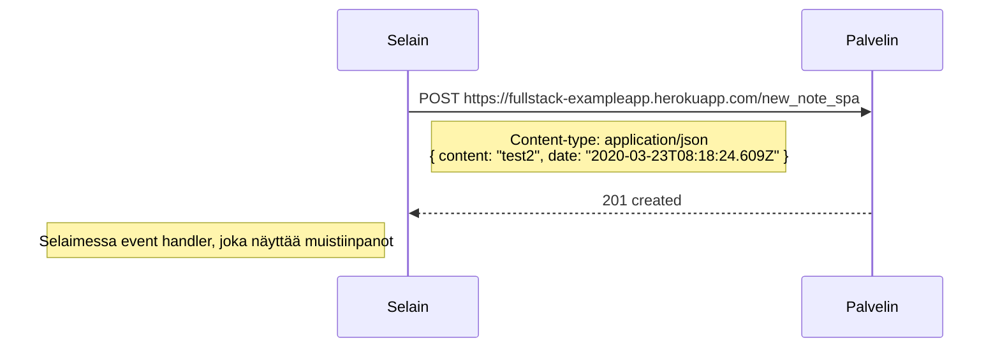

# 0.6 Single page app - Muistiinpanon lisääminen

```mermaid
sequenceDiagram
    participant Selain
    participant Palvelin

    Selain->>Palvelin: POST https://fullstack-exampleapp.herokuapp.com/new_note_spa
    Note right of Selain: Content-type: application/json <br/> { content: "test2", date: "2020-03-23T08:18:24.609Z" }

    Palvelin-->>Selain: 201 created

    Note left of Selain: Selaimessa event handler, joka näyttää muistiinpanot
```